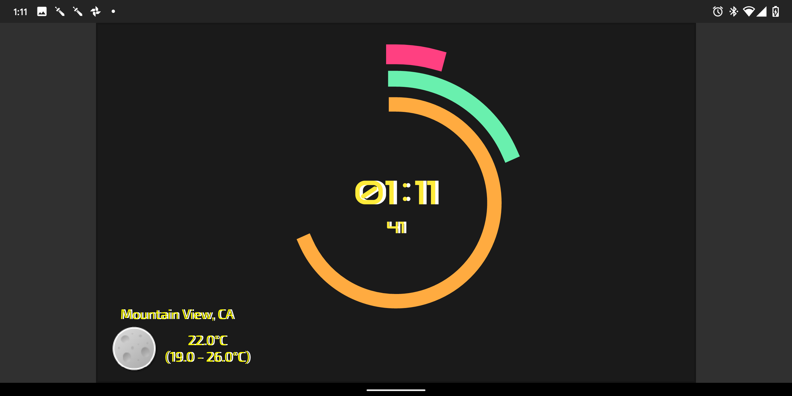
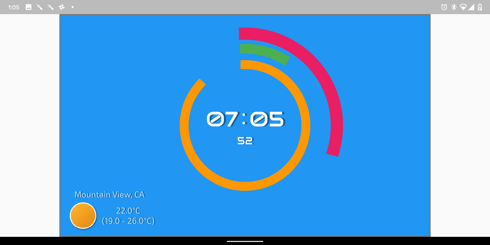

# flutter_clock_challenge Evan Lynch Clock Visual Clack

this clock is inspired form a visual timer used to help people with disability's like ASD.

## you can see it live here

[Live Demo](https://evanlynch-flutterclock-challenge.surge.sh/web/index.html#/)

Icons Form : https://www.deviantart.com/kortoik/art/Sticker-Weather-Icons-78827487

